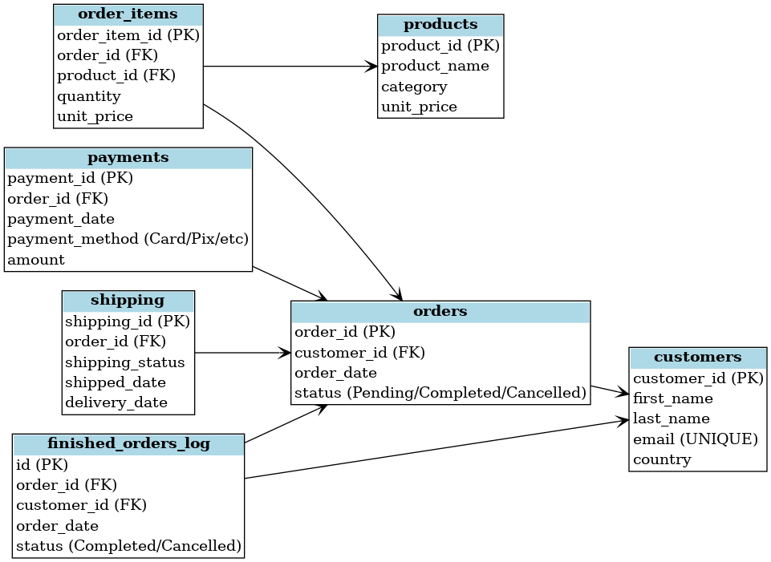

# Design Document — E-commerce Database and Dashboard

By Gabriel Argentino Lima
GitHub username: ArgenGab
edX username: GabrielArgentino
LinkedIn: www.linkedin.com/in/gabriel-argentino-41a4ab304
São Paulo - Brazil
05/23/2025

---

## Scope

The e-commerce database includes all entities necessary to manage the operations of an online store, including products, customers, orders, payments, and shipping. Within the scope of this project are:

- Customers, including identifying information and country.
- Products, including categories and pricing.
- Orders processing, including order items, payment details, and shipping status.
- A log of order status changes (trigger-based).
- Sales analysis by period, country, category, and product performance.

**Out of scope** are features like abandoned carts, product reviews, discount systems, or return processes.

---

## Functional Requirements

This system supports:

- **CRUD operations** for customers, products, and orders.
- Full order processing, including:
  - Multiple items per order.
  - Order status management (`Pending`, `Completed`, `Cancelled`).
  - Shipping status tracking (`Pending`, `Shipped`, `Delivered`, `Returned`).
  - Payment tracking with multiple methods (Pix, Credit Card, PayPal, etc.).
- Automatic logging of finalized orders (`Completed` or `Cancelled`) using a trigger.
- Operational and strategic analysis in Power BI:
  - Total revenue.
  - Monthly revenue.
  - Best-selling products.
  - Revenue by country and category.
  - Cancellation rate.
  - Average order value.
  - Top customers.

---

## Representation

### Entities

The database includes the following main entities:

---

#### Customers

The `customers` table includes:

- `customer_id`: Unique identifier (`INTEGER PRIMARY KEY`).
- `first_name`: Customer's first name (`TEXT NOT NULL`).
- `last_name`: Customer's last name (`TEXT NOT NULL`).
- `email`: Customer's email (`TEXT UNIQUE NOT NULL`).
- `country`: Customer's country (`TEXT NOT NULL`).

---

#### Products

The `products` table includes:

- `product_id`: Unique identifier (`INTEGER PRIMARY KEY`).
- `product_name`: Product name (`TEXT NOT NULL`).
- `category`: Product category (`TEXT NOT NULL`).
- `unit_price`: Product price (`REAL NOT NULL`).

---

#### Orders

The `orders` table represents customer orders:

- `order_id`: Unique identifier (`INTEGER PRIMARY KEY`).
- `customer_id`: Linked customer (`INTEGER NOT NULL`, `FOREIGN KEY`).
- `order_date`: Date of the order (`DATE NOT NULL`).
- `status`: Order status (`TEXT NOT NULL`), restricted to (`Pending`, `Completed`, `Cancelled`).

---

#### Order_Items

The `order_items` table represents items within each order:

- `order_item_id`: Unique identifier (`INTEGER PRIMARY KEY`).
- `order_id`: Linked order (`INTEGER NOT NULL`, `FOREIGN KEY`).
- `product_id`: Linked product (`INTEGER NOT NULL`, `FOREIGN KEY`).
- `quantity`: Quantity ordered (`INTEGER NOT NULL`).
- `unit_price`: Unit price at the time of the order (`REAL NOT NULL`).

---

#### Payments

The `payments` table tracks payments:

- `payment_id`: Unique identifier (`INTEGER PRIMARY KEY`).
- `order_id`: Linked order (`INTEGER NOT NULL`, `FOREIGN KEY`).
- `payment_date`: Date of payment (`DATE NOT NULL`).
- `payment_method`: Payment method (`TEXT NOT NULL`), restricted to (`Credit Card`, `Debit Card`, `Pix`, `Boleto`, `PayPal`).
- `amount`: Payment amount (`REAL NOT NULL`).

---

#### Shipping

The `shipping` table tracks shipping status:

- `shipping_id`: Unique identifier (`INTEGER PRIMARY KEY`).
- `order_id`: Linked order (`INTEGER NOT NULL`, `FOREIGN KEY`).
- `shipping_status`: Status (`TEXT NOT NULL`), restricted to (`Pending`, `Shipped`, `Delivered`, `Returned`).
- `shipped_date`: Date shipped (`DATE`).
- `delivery_date`: Date delivered (`DATE`).

---

#### Finished_Orders_Log

The `finished_orders_log` table logs orders that changed to `Completed` or `Cancelled`:

- `id`: Unique identifier (`INTEGER PRIMARY KEY AUTOINCREMENT`).
- `order_id`: Linked order (`INTEGER NOT NULL`, `FOREIGN KEY`).
- `customer_id`: Linked customer (`INTEGER NOT NULL`, `FOREIGN KEY`).
- `order_date`: Date of the order (`DATE NOT NULL`).
- `status`: Final status (`Completed` or `Cancelled`).

---

### Relationships

The below entity relationship diagram describes the relationships among the entities in the database.

As detailed by the diagram:

- A **customer** can have multiple **orders**, but each order belongs to one customer.
- An **order** contains multiple **order items**, each linked to a specific product.
- An **order** can have one or more **payments**, but each payment is linked to a single order.
- An **order** has a corresponding **shipping** entry to track delivery status.
- The **finished_orders_log** captures order completion or cancellation, linked to both the order and the customer.

---

## Optimizations

Optimizations were made based on expected query patterns:

- Indexes on:
  - `email` in the `customers` table for fast lookup.
  - `product_name` in the `products` table.
  - `order_date` in the `orders` table for time-based queries.
  - `shipping_status` in the `shipping` table for delivery tracking.

In Power BI, optimized measures include:

- Monthly revenue tracking.
- Revenue breakdown by country and category.
- Product sales performance.
- Customer behavior metrics like cancellation rates and top spenders.

---

## Limitations

- No stock or inventory management is included.
- No returns, refunds, or product review system.
- Customers are assumed to have a single shipping address.
- Each order has one shipping and one payment record (this can be extended in future versions).

---

## Video Overview

---

